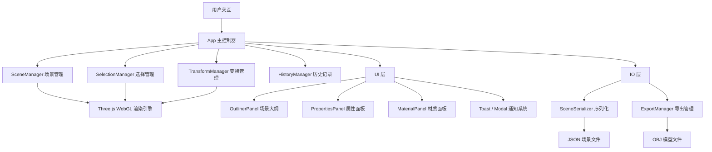

# 🏗️ Vertex 3D - 浏览器端三维建模工具

> 基于 WebGL 的轻量级 3D 建模工具，无需安装任何软件，在浏览器中即可完成基础三维建模工作流。

## 🛠 技术栈

- Frontend: HTML5 + CSS3 + JavaScript (ES6+)
- 3D Engine: Three.js r128 (WebGL 2.0)
- Backend: 无
- Database: 无

## 🏗️ 系统架构



## 🚀 启动指南

本项目为纯前端项目（前端 HTML/CSS/JS，后端 none，数据库 none），无需安装任何依赖，无需 Docker，直接在浏览器中打开即可运行。

### 方式一：直接打开
1. 在根目录找到 `index.html`
2. 双击用浏览器打开（推荐 Chrome / Edge / Firefox）

### 方式二：本地服务器（推荐）
使用任意静态文件服务器，例如：

```bash
# Python
python -m http.server 3000

# Node.js (需安装 serve)
npx serve -p 3000

# VS Code Live Server 插件
# 右键 index.html -> Open with Live Server
```

访问地址：http://localhost:3000

## 🔑 关键实现路径

1. WebGL 渲染引擎搭建（Three.js 场景/相机/灯光/网格）
2. 基础图元工厂与对象管理系统
3. 变换 Gizmo 交互（移动/旋转/缩放）
4. 右侧面板 UI（场景大纲 + 属性编辑 + 材质编辑）
5. 场景序列化与文件导入导出

## 📷 核心功能

### 🎨 3D 基础图元创建
- 立方体、球体、圆柱体、圆锥体、圆环体、平面
- 点光源、聚光灯
- 场景大纲面板快速添加按钮（+号弹出菜单）

### 🔄 变换操作
- 移动 (G)、旋转 (R)、缩放 (S)
- 可视化 Gizmo 操控手柄（Three.js TransformControls）
- 吸附功能（网格对齐，支持位移/旋转/缩放吸附）
- 属性面板精确数值输入（支持 X/Y/Z 三轴独立编辑）

### 📋 场景管理
- 场景大纲树形列表（含对象类型图标）
- 对象选择、双击重命名、显示/隐藏、删除
- 鼠标射线拾取选择（Raycaster）
- 右键上下文菜单（复制/删除/聚焦/快速添加）

### 🎭 材质编辑
- 颜色拾取器、粗糙度/金属度滑块调节
- 透明度控制（自动切换 transparent 模式）
- 平面着色 / 线框模式切换
- 双面渲染切换、渲染面选择

### 📐 视图控制
- 透视 / 正交投影切换（Numpad 5）
- 前/后/左/右/顶/底 预设视角（Numpad 1/3/7 + Shift）
- 导航立方体快速切换视角
- 聚焦选中对象（自动计算包围盒居中）
- 网格/坐标轴显示开关

### 💾 导入导出
- JSON 场景保存与加载（完整序列化含材质、变换、光源属性）
- OBJ 格式导出（支持法线、世界坐标变换）
- 文件菜单：新建/打开/保存/另存为/导出

### ↩️ 撤销/重做
- 支持最多 50 步操作历史
- 覆盖添加、删除、变换、材质修改四类操作

### 🖥️ 界面交互
- Blender 风格深色主题，视觉层次清晰
- 顶部菜单栏（文件/编辑/添加/视图/帮助）含下拉菜单
- 左侧工具栏（选择工具 + 基础体 + 光源）
- 右侧三面板（场景大纲 + 属性 + 材质），支持折叠
- 底部状态栏（版本信息 + 变换状态 + 渲染器信息）
- 视口覆盖层（视图模式 + FPS + 对象计数 + 导航立方体）
- Toast 通知替代原生 alert，Modal 确认框替代原生 confirm
- 所有按钮均有 hover/active 交互反馈

## ⌨️ 快捷键

| 操作 | 快捷键 |
|------|--------|
| 选择工具 | W |
| 移动 | G |
| 旋转 | R |
| 缩放 | S |
| 删除 | Delete / X |
| 撤销 | Ctrl+Z |
| 重做 | Ctrl+Shift+Z |
| 复制 | Ctrl+D |
| 全选 | A |
| 新建场景 | Ctrl+N |
| 保存场景 | Ctrl+S |
| 打开场景 | Ctrl+O |
| 线框模式 | Z |
| 透视/正交 | Numpad 5 |
| 前视图 | Numpad 1 |
| 右视图 | Numpad 3 |
| 顶视图 | Numpad 7 |
| 聚焦选中 | Numpad . |

## 📁 项目结构

```
├── index.html                    # 应用入口（Blender 风格三栏布局）
├── README.md                     # 项目文档
└── src/
    ├── css/
    │   ├── variables.css         # CSS 设计令牌（颜色、间距、字体、z-index）
    │   ├── base.css              # 全局重置与基础样式
    │   ├── layout.css            # 主布局（菜单栏、状态栏、变换模式组）
    │   ├── toolbar.css           # 左侧工具栏样式
    │   ├── panels.css            # 右侧面板样式（大纲、属性、材质）
    │   ├── components.css        # 通用组件（Toast、下拉菜单、按钮、上下文菜单）
    │   ├── viewport.css          # 3D 视口样式（覆盖层、导航立方体、视口工具条）
    │   └── modal.css             # 模态框样式（确认框、快捷键列表、关于）
    └── js/
        ├── utils/
        │   ├── Logger.js         # 分级日志系统（DEBUG/INFO/WARN/ERROR）
        │   └── EventBus.js       # 全局事件总线（模块间松耦合通信）
        ├── ui/
        │   ├── Toast.js          # 消息通知组件（2秒去重机制）
        │   ├── Modal.js          # 模态框组件（confirm/about/shortcuts）
        │   └── DropdownMenu.js   # 下拉菜单管理（5组菜单定义）
        ├── core/
        │   ├── SceneManager.js   # 3D 场景核心（渲染器、相机、灯光、网格、动画循环）
        │   ├── ObjectFactory.js  # 对象工厂（6种几何体 + 2种光源，工厂模式）
        │   ├── SelectionManager.js # 选择管理（Raycaster 射线拾取、高亮反馈）
        │   ├── TransformManager.js # 变换管理（移动/旋转/缩放模式切换）
        │   └── HistoryManager.js # 撤销/重做历史栈（50步上限）
        ├── panels/
        │   ├── OutlinerPanel.js  # 场景大纲面板（列表渲染、重命名、快速添加菜单）
        │   ├── PropertiesPanel.js # 属性编辑面板（位置/旋转/缩放 + 光源属性）
        │   └── MaterialPanel.js  # 材质编辑面板（颜色/粗糙度/金属度/透明度）
        ├── io/
        │   ├── SceneSerializer.js # 场景序列化/反序列化（JSON 格式）
        │   └── ExportManager.js  # 文件导入导出（JSON 保存加载 + OBJ 导出）
        └── App.js                # 应用主入口（模块初始化、全局事件绑定、快捷键）
```

## 🔧 专业工程实践

### 1. 日志系统
- 统一 Logger 模块，支持 DEBUG/INFO/WARN/ERROR 四级日志
- 带时间戳和模块标识（如 `[SceneManager]`、`[ExportManager]`），便于问题定位
- 可通过 `Logger.setLevel()` 动态调整日志级别

### 2. 错误处理
- Toast 通知替代原生 alert，提供友好的用户反馈（info/success/warning/error 四种类型）
- Modal 确认框替代原生 confirm，保持视觉风格统一
- 消息去重机制（2秒内相同消息不重复显示，防止快速重复点击）
- 文件加载、导出、场景序列化等 IO 操作均有 try-catch 保护
- WebGL 支持检测，不支持时给出明确错误提示

### 3. 数据校验
- 属性面板输入值 NaN 检查，防止非法数值写入对象
- 场景文件加载格式验证（检查 version、objects 字段）
- 对象类型映射校验（未知类型跳过并记录日志）

### 4. 接口设计
- EventBus 事件总线实现模块间松耦合（30+ 事件类型）
- ObjectFactory 工厂模式统一对象创建（`create(type, options)` 统一入口）
- SceneSerializer 序列化/反序列化分离，支持多格式导出
- 面板组件通过事件订阅自动响应选择/变换变化，无直接依赖

### 5. 生产级特性清单

| 维度 | 状态 | 说明 |
|------|------|------|
| 模块化架构 | ✅ | 15个独立模块，按职责分层（core/ui/panels/io） |
| 事件驱动解耦 | ✅ | EventBus 全局事件总线，模块间零直接依赖 |
| 撤销/重做 | ✅ | 50步历史栈，覆盖增删改四类操作 |
| 键盘快捷键 | ✅ | 18个快捷键，覆盖全部核心操作 |
| 响应式布局 | ✅ | 窗口 resize 自动适配相机和渲染器 |
| 场景持久化 | ✅ | JSON 序列化保存/加载完整场景 |
| 多格式导出 | ✅ | JSON + OBJ 双格式导出 |
| 统一日志系统 | ✅ | 四级日志，带时间戳和模块标识 |
| 错误边界处理 | ✅ | try-catch + Toast 友好提示 |
| 消息去重 | ✅ | 2秒去重 + 自定义 Toast/Modal 替代原生弹窗 |
| 现代化交互 | ✅ | hover/active 反馈、过渡动画、上下文菜单 |
